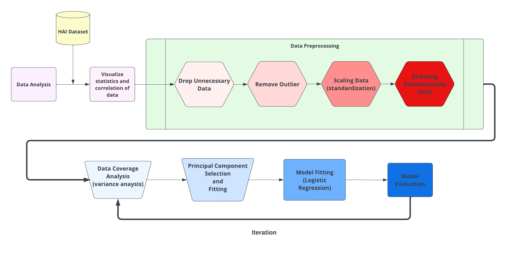

# Anomaly Detection
This is Final Assignment for the lecture 'AI and Security Techniques, 2021 Fall'

## Short Description
For the given dataset of [HAI(HIL-BASED AUGMENTED ICS)](#hai), 
construct appropriate ML pipeline for anomaly detection.
Then, get the best performance for a test dataset.
For more information, you can check [this file](./docs/description_for_HAI_Dataset_and_TaPR.pdf)

## ML pipeline 

## Key Process
There were few key processes contributing highly to the prediction accuracy.  
- Outlier Removal
- Principal Component Selection

Without removing outlier, the score of model is far decreased.  
The outliers should be removed or filtered before scaling process.  
The outliers affects the scaling range and also following processes.  

Selecting principal component affects model accuracy a lot.  
It should be the one covers enough features to explain all important features.  

## Terms
### HAI
which is collection of realistic ICS testbed augmented with a hardware-in-the-loop
simulator that emulated steam-turbine power generation and pumped-storage 
hydropower generation